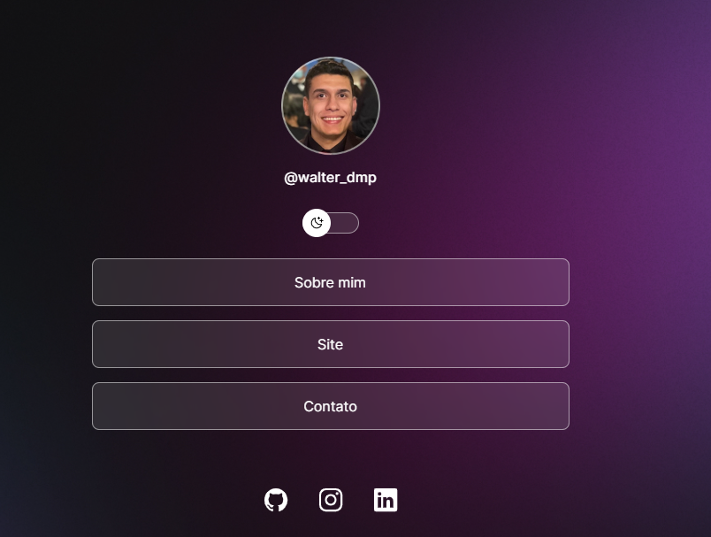
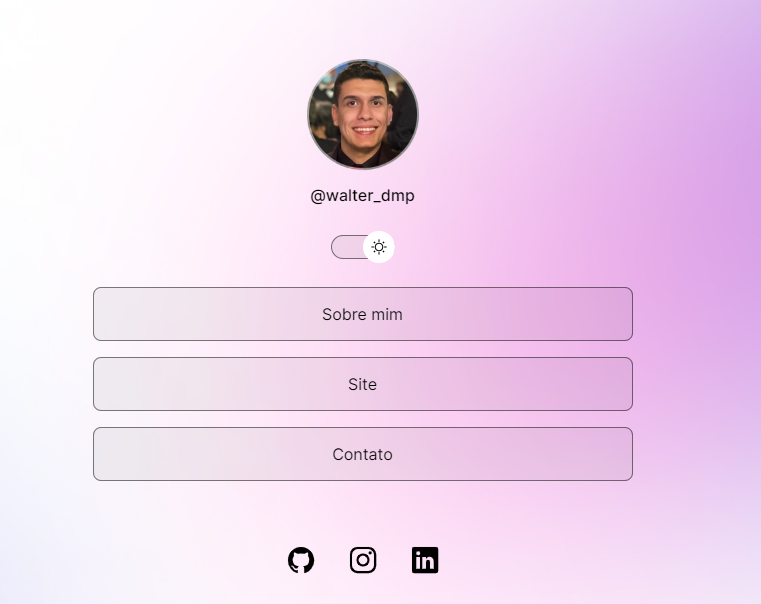

<h1 align="center"> Site de Links </h1>

## 🚀 Tecnologias

Esse projeto foi desenvolvido com as seguintes tecnologias:

- HTML e CSS
- JavaScript
- Git e Github
- Figma

## 💻 Projeto

O WalterLinks é um agregador de links para usar como cartão de visitas online.

 ### Tela Escura:

<figure>
  
</figure>

### Tela Clara:

<figure>
  
</figure>
